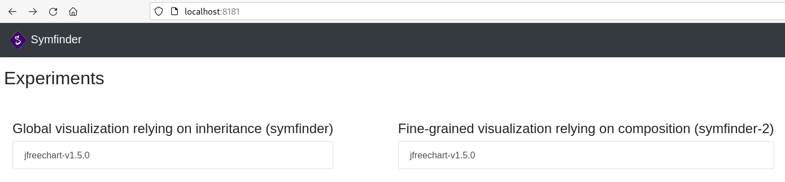
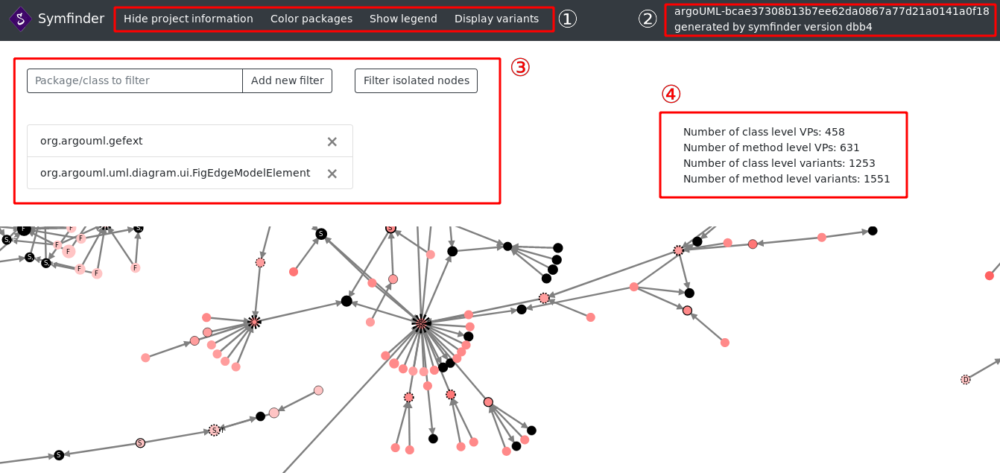
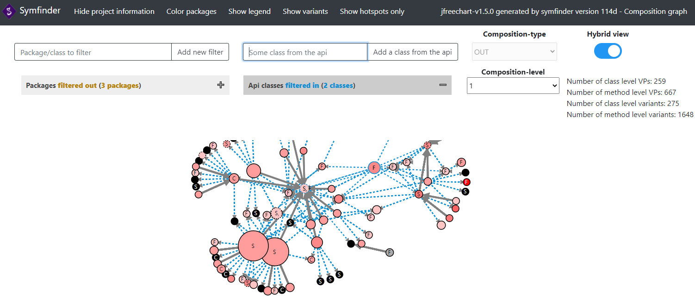

# How I Met Your Implemented Variability: Identification in Object-Oriented Systems with symfinder

## Johann Mortara - Philippe Collet

symfinder is a toolchain parsing a single Java codebase to identify potential variability implementations.
The output of symfinder consists in JSON files containing information on the presence of variability implementations in the analysed codebase (e.g. if a class has been identified as a variation point or a variant, number of variants of an identified variation point…).

## Table of contents

- [Toolchain description](#toolchain-description)
  - [symfinder fetcher](#symfinder-fetcher)
  - [symfinder runner](#symfinder-runner)
  - [symfinder engine](#symfinder-engine)
  - [Neo4j database](#neo4j-database)
  - [Visualization](#visualization)
- [Requirements](#requirements)
- [Getting symfinder](#getting-symfinder)
  - [Cloning the Git repository](#cloning-the-git-repository)
  - [Downloading a ZIP archive](#downloading-a-zip-archive)
- [Using symfinder](#using-symfinder)
  - [Steps 1 and 2: Cloning sources and identifying variability implementations](#steps-1-and-2-cloning-sources-and-identifying-variability-implementations)
    - [Checking that symfinder works](#checking-that-symfinder-works)
    - [Troubleshooting known Windows related issues](#troubleshooting-known-windows-related-issues)
  - [Step 3: Visualizing the variability implementations](#step-3-visualizing-the-variability-implementations)
    - [Inheritance visualization](#inheritance-visualization)
- [Adapting symfinder for your project](#adapting-symfinder-for-your-project)
- [To go further](#to-go-further)
  - [Fine-grained visualization relying on composition (symfinder-2)](#fine-grained-visualization-relying-on-composition-symfinder-2)
  - [symfinder configuration](#symfinder-configuration)
    - [Neo4j parameters](#neo4j-parameters)
    - [Experiments file](#experiments-file)
  

## Toolchain description

The toolchain is made of 5 different parts, provided as Docker images available on the [Docker Hub](https://hub.docker.com/).

### symfinder fetcher
**Docker image: `deathstar3/symfinder-fetcher`**

The symfinder fetcher downloads the sources of the projects to analyze and generates the visualization pages.

Technologies: Python scripts

### symfinder runner
**Docker image: `deathstar3/symfinder-runner`**

The symfinder runner manages the symfinder engine and the Neo4j database, creating instances of their Docker containers for every analysed project.

Technologies: Python scripts

### symfinder engine
**Docker image: `deathstar3/symfinder-engine`**

The symfinder engine parses the sources, identifies the variability implementations in them, relying on the Neo4j database for storing, and outputs the information to visualize in a JSON format.

Technologies:
- language: Java
- Java parsing library: Eclipse JDT
- build: Maven
- unit tests: JUnit

### Neo4j database
**Docker image: `deathstar3/symfinder-neo4j`**

The Neo4j database stores information about the code structure (classes, methods, inheritance links…) that are then queried to identify the variability implementations and compute measures on them.

### Visualization
**Docker image: `python`**

The visualization displays under the form of a graph the variability implementations.

Technologies: 
- visualization framework: D3.js
- exposing server: Python server 

## Requirements

Requirements can be found in the [REQUIREMENTS.md](REQUIREMENTS.md) file.

## Getting symfinder

1. Download the sources

### Cloning the Git repository

1. Open a terminal and clone the repository by running:

```bash
git clone https://github.com/DeathStar3/symfinder-SPLC2021-tutorial
```

2. Move in the project directory

 ```bash
cd symfinder-SPLC2021-tutorial
```

2. Checkout the `tutorial` tag

 ```bash
git checkout tutorial
```

### Downloading a ZIP archive

1. Go to the GitHub page of symfinder showing the sources for the `tutorial` tag: https://github.com/DeathStar3/symfinder-SPLC2021-tutorial/tree/tutorial
2. Click the green `Code` button on the top, and click `Download ZIP`.
3. Unzip the archive you just downloaded, and move in the unique directory at the root of the archive.

## Using symfinder

symfinder is pre-configured with 4 projects to analyze:
- [JFreeChart 1.5.0](https://github.com/jfree/jfreechart/tree/v1.5.0/src/main/java/org/jfree) (identifier: `jfreechart`)
- [Java AWT 8u202-b1532](https://github.com/JetBrains/jdk8u_jdk/tree/jb8u202-b1532/src/share/classes/java/awt) (identifier: `awt`)
- [ArgoUML](https://github.com/marcusvnac/argouml-spl/tree/bcae37308b13b7ee62da0867a77d21a0141a0f18/src) (identifier: `argoUML`)
- [JavaGeom](https://github.com/dlegland/javaGeom/tree/7e5ee60ea9febe2acbadb75557d9659d7fafdd28) (identifier: `javaGeom`)


### Steps 1 and 2: Cloning sources and identifying variability implementations


*Note:* All the commands given in this section are executed from the directory where this README file is located.

Run a project analysis by running

- On GNU/Linux and macOS

    ```
    ./run.sh <project_name>
    ```

- On Windows

    ```
    run.bat <project_name>
    ```

with `<project_name>` being the identifier of the project. 
In the tutorial, we will run symfinder on JFreeChart by running:

```
./run.sh jfreechart
```

Not specifying a project runs all the declared experiments.
More details about the analysed projects and their definition are given in the [Adapting symfinder for your project](#adapting-symfinder-for-your-project) section.

*Note:* The Docker images are automatically downloaded by Docker with the tag `splc2021-tutorial` if they are not found on the host system.
If an image is not found, you can download it manually with the `docker pull` command

Example of command to download the `deathstar3/symfinder-fetcher` image with tag `splc2021-tutorial`:
```
docker pull deathstar3/symfinder-fetcher:splc2021-tutorial
```

#### Checking that symfinder works
Hereafter, we illustrate the different steps of the execution of symfinder by giving excerpts of console outputs corresponding to the execution of symfinder on a single project, JFreeChart.

1. First, symfinder creates the directories containing the analyzed project(s) sources and generated visualization files,
   and clones the directory of the analyzed project(s), checking out the desired tags/commits.
```
$ ./run.sh jfreechart
resources directory already exists
generated_visualizations directory already exists
Using splc2021-tuto images
Cloning into 'resources/jfreechart'...
Note: switching to 'tags/v1.5.0'.

You are in 'detached HEAD' state. You can look around, make experimental
changes and commit them, and you can discard any commits you make in this
state without impacting any branches by switching back to a branch.

If you want to create a new branch to retain commits you create, you may
do so (now or later) by using -c with the switch command. Example:

  git switch -c <new-branch-name>

Or undo this operation with:

  git switch -

Turn off this advice by setting config variable advice.detachedHead to false

HEAD is now at fd72df7c Prepare for 1.5.0 release.
HEAD is now at fd72df7c Prepare for 1.5.0 release.
```
2. Then, the `symfinder-runner` container starts, and creates two other Docker containers:
- `symfinder-neo4j`, a Neo4j database used to store information about the analyzed project (classes, methods, identified variation points and variants…)
- `symfinder`, being the symfinder engine which parses the codebase of the project and populates the Neo4j database.
```
Creating network "symfinder-SPLC2021-tutorial_default" with the default driver
Creating symfinder-runner ... done
Attaching to symfinder-runner
symfinder-runner | Cleaning previous execution...
symfinder-runner | Removing network default_default
symfinder-runner | Network default_default not found.
symfinder-runner | Creating network "default_default" with the default driver
symfinder-runner | Creating symfinder-neo4j ... 
symfinder-runner | Creating symfinder-neo4j ... done
symfinder-runner | Creating symfinder       ... 
symfinder-runner | Creating symfinder       ... done
symfinder-runner | Attaching to symfinder-neo4j, symfinder
symfinder-runner | symfinder-neo4j | Changed password for user 'neo4j'.
symfinder-runner | symfinder    | WARNING: sun.reflect.Reflection.getCallerClass is not supported. This will impact performance.
symfinder-runner | symfinder    | Jul 30, 2021 9:16:05 AM org.neo4j.driver.internal.logging.JULogger info
symfinder-runner | symfinder    | INFO: Direct driver instance 1489933928 created for server address neo4j:7687
symfinder-runner | symfinder    | 09:16:05.503 [main] MY_LEVEL Symfinder - Symfinder version: 84ef141e60a9414c842e35abdfb5303dc9a204cf
symfinder-runner | symfinder-neo4j | Directories in use:
symfinder-runner | symfinder-neo4j |   home:         /var/lib/neo4j
symfinder-runner | symfinder-neo4j |   config:       /var/lib/neo4j/conf
symfinder-runner | symfinder-neo4j |   logs:         /logs
symfinder-runner | symfinder-neo4j |   plugins:      /plugins
symfinder-runner | symfinder-neo4j |   import:       /var/lib/neo4j/import
symfinder-runner | symfinder-neo4j |   data:         /var/lib/neo4j/data
symfinder-runner | symfinder-neo4j |   certificates: /var/lib/neo4j/certificates
symfinder-runner | symfinder-neo4j |   run:          /var/lib/neo4j/run
symfinder-runner | symfinder-neo4j | Starting Neo4j.
symfinder-runner | symfinder    | Waiting for Neo4j database to be ready...
symfinder-runner | symfinder-neo4j | 2021-07-30 09:16:06.028+0000 INFO  ======== Neo4j 4.0.3 ========
symfinder-runner | symfinder-neo4j | 2021-07-30 09:16:06.033+0000 INFO  Starting...
symfinder-runner | symfinder    | Waiting for Neo4j database to be ready...
symfinder-runner | symfinder-neo4j | 2021-07-30 09:16:13.356+0000 INFO  Called db.clearQueryCaches(): Query cache already empty.
symfinder-runner | symfinder-neo4j | 2021-07-30 09:16:13.404+0000 INFO  Bolt enabled on 0.0.0.0:7687.
symfinder-runner | symfinder-neo4j | 2021-07-30 09:16:13.405+0000 INFO  Started.
symfinder-runner | symfinder-neo4j | 2021-07-30 09:16:13.972+0000 INFO  Remote interface available at http://0.0.0.0:7474/
symfinder-runner | symfinder    | 09:16:15.780 [main] MY_LEVEL Symfinder - ClassesVisitor
symfinder-runner | symfinder    | 09:16:16.300 [main] INFO  visitors.SymfinderVisitor - Visitor: visitors.ClassesVisitor - Class: org.jfree.chart.ui.StrokeChooserPanel
symfinder-runner | symfinder    | 09:16:17.045 [main] INFO  visitors.SymfinderVisitor - Visitor: visitors.ClassesVisitor - Class: org.jfree.chart.ui.ApplicationFrame
symfinder-runner | symfinder    | 09:16:17.228 [main] INFO  visitors.SymfinderVisitor - Visitor: visitors.ClassesVisitor - Class: org.jfree.chart.ui.FontChooserPanel
symfinder-runner | symfinder    | 09:16:17.346 [main] INFO  visitors.SymfinderVisitor - Visitor: visitors.ClassesVisitor - Class: org.jfree.chart.ui.PaintSample
symfinder-runner | symfinder    | 09:16:17.438 [main] INFO  visitors.SymfinderVisitor - Visitor: visitors.ClassesVisitor - Class: org.jfree.chart.ui.GradientPaintTransformType
symfinder-runner | symfinder    | 09:16:17.532 [main] INFO  visitors.SymfinderVisitor - Visitor: visitors.ClassesVisitor - Class: org.jfree.chart.ui.StrokeSample
```
Five visitors are run on the codebase: `ClassesVisitor`, `GraphBuilderVisitor`, `StrategyTemplateDecoratorVisitor`, `FactoryVisitor`, and `ComposeTypeVisitor`.

3. At the end of the successive parsings, a summary of the results of the execution is given, and the `symfinder-runner` stops the `symfinder-neo4j` and `symfinder` containers.
   If multiple projects are analyzed, step 2. is executed for each project.
```
symfinder-runner | symfinder    | 09:21:19.953 [main] INFO  visitors.SymfinderVisitor - Visitor: visitors.ComposeTypeVisitor - Class: org.jfree.data.KeyedObjects2D
symfinder-runner | symfinder    | 09:21:20.224 [main] INFO  visitors.SymfinderVisitor - Visitor: visitors.ComposeTypeVisitor - Class: org.jfree.data.category.IntervalCategoryDataset
symfinder-runner | symfinder    | 09:21:20.299 [main] INFO  visitors.SymfinderVisitor - Visitor: visitors.ComposeTypeVisitor - Class: org.jfree.data.category.DefaultCategoryDataset
symfinder-runner | symfinder    | 09:21:20.642 [main] INFO  visitors.SymfinderVisitor - Visitor: visitors.ComposeTypeVisitor - Class: org.jfree.data.category.SlidingCategoryDataset
symfinder-runner | symfinder    | 09:21:20.830 [main] INFO  visitors.SymfinderVisitor - Visitor: visitors.ComposeTypeVisitor - Class: org.jfree.data.category.CategoryToPieDataset
symfinder-runner | symfinder    | 09:21:20.984 [main] INFO  visitors.SymfinderVisitor - Visitor: visitors.ComposeTypeVisitor - Class: org.jfree.data.category.CategoryDataset
symfinder-runner | symfinder    | 09:21:20.985 [main] INFO  visitors.SymfinderVisitor - Visitor: visitors.ComposeTypeVisitor - Class: org.jfree.data.category.CategoryRangeInfo
symfinder-runner | symfinder    | 09:21:21.011 [main] INFO  visitors.SymfinderVisitor - Visitor: visitors.ComposeTypeVisitor - Class: org.jfree.data.category.DefaultIntervalCategoryDataset
symfinder-runner | symfinder    | 09:21:21.417 [main] MY_LEVEL Symfinder - visitors.ComposeTypeVisitor execution time: 00:02:17.476
symfinder-runner | symfinder    | 09:21:27.381 [main] MY_LEVEL Symfinder - Number of VPs: 926
symfinder-runner | symfinder    | 09:21:27.385 [main] MY_LEVEL Symfinder - Number of methods VPs: 454
symfinder-runner | symfinder    | 09:21:27.388 [main] MY_LEVEL Symfinder - Number of constructors VPs: 213
symfinder-runner | symfinder    | 09:21:27.395 [main] MY_LEVEL Symfinder - Number of method level VPs: 667
symfinder-runner | symfinder    | 09:21:27.396 [main] MY_LEVEL Symfinder - Number of class level VPs: 259
symfinder-runner | symfinder    | 09:21:27.427 [main] MY_LEVEL Symfinder - Number of variants: 1923
symfinder-runner | symfinder    | 09:21:27.430 [main] MY_LEVEL Symfinder - Number of methods variants: 1061
symfinder-runner | symfinder    | 09:21:27.433 [main] MY_LEVEL Symfinder - Number of constructors variants: 587
symfinder-runner | symfinder    | 09:21:27.439 [main] MY_LEVEL Symfinder - Number of method level variants: 1648
symfinder-runner | symfinder    | 09:21:27.440 [main] MY_LEVEL Symfinder - Number of class level variants: 275
symfinder-runner | symfinder    | 09:21:27.452 [main] MY_LEVEL Symfinder - Number of nodes: 9526
symfinder-runner | symfinder    | 09:21:27.461 [main] MY_LEVEL Symfinder - Number of relationships: 11438
symfinder-runner | symfinder    | 09:21:27.470 [main] MY_LEVEL Symfinder - Number of corrected inheritance relationships: 265/1478
symfinder-runner | symfinder    | Jul 30, 2021 9:21:28 AM org.neo4j.driver.internal.logging.JULogger info
symfinder-runner | symfinder    | INFO: Closing driver instance 1489933928
symfinder-runner | symfinder    | Jul 30, 2021 9:21:28 AM org.neo4j.driver.internal.logging.JULogger info
symfinder-runner | symfinder    | INFO: Closing connection pool towards neo4j:7687
symfinder-runner | symfinder    | 09:21:28.701 [main] MY_LEVEL Symfinder - Total execution time: 00:05:23.198
symfinder-runner | symfinder exited with code 0
symfinder-runner | Stopping symfinder-neo4j ... 
symfinder-runner | Stopping symfinder-neo4j ... done
symfinder-runner | Aborting on container exit...
symfinder-runner | Removing symfinder       ... 
symfinder-runner | Removing symfinder-neo4j ... 
symfinder-runner | Removing symfinder       ... done
symfinder-runner | Removing symfinder-neo4j ... done
```
4. Finally, after analysing the last project, `symfinder-runner` exists with code `0`.
```
symfinder-runner | Removing network default_default
symfinder-runner exited with code 0
```

5. By running symfinder on JFreeChart only, the `generated_visualizations` directory at the root of the project shall now have the following structure:
```
├── generated_visualizations
│     ├── data
│     │     ├── jfreechart-v1.5.0.json
│     │     ├── jfreechart-v1.5.0-stats.json
│     ├── index.html
│     ├── jfreechart-v1.5.0-composition.html
│     ├── jfreechart-v1.5.0.html
│     ├── jfreechart-v1.5.0.log
│     ├── scripts
│     │     ├── api-filter.js
│     │     ├── filter.js
│     │     ├── graphcomposition.js
│     │     ├── graph.js
│     │     ├── isolated-filter.js
│     │     ├── nodes-filter.js
│     │     ├── package-colorer.js
│     │     └── variants-filter.js
│     ├── style.css
│     ├── symfinder-icon.png
│     └── symfinder-legend.svg
```
Files starting by `jfreechart-v1.5.0` correspond to files generated by analysing JFreeChart with symfinder.
For every project `XXX` of tag `YYY` on which you run symfinder, you should obtain the following additional files:
```
├── generated_visualizations
│     ├── data
│     │     ├── XXX-YYY.json
│     │     ├── XXX-YYY.stats.json
│     ├── XXX-YYY-composition.html
│     ├── XXX-YYY.html
│     ├── XXX-YYY.log
```

#### Troubleshooting known Windows related issues

- If you run symfinder on a Windows system, symfinder must be placed somewhere on your `C:` drive.

- On Windows, you may encounter the following error:
```
docker.errors.DockerException: Credentials store error: StoreError('Credentials store docker-credential-osxkeychain exited with "The user name or passphrase you entered is not correct.".',)
[49981] Failed to execute script docker-compose
```
To solve this issue, you may open Docker Desktop and connect to your Docker Hub account.


### Step 3: Visualizing the variability implementations

Once the analyses are finished, run

- On GNU/Linux and macOS

```
./visualization.sh
```

- On Windows

```
visualization.bat
```
Then, in your web browser, go to `http://localhost:8181`.
An index page will appear with the list of the analysed projects.



For every project, you can display:
- the visualization of its variability implementations exhibiting classes and the inheritance relationships linking them (symfinder;
- the visualization displaying also usage relationships between classes, which can be refined by defining entry point classes (symfinder-2).

In this tutorial, we will focus on the visualization relying on inheritance.
Click on the `jfreechart-v1.5.0` button in the first column to view its visualization.

#### Inheritance visualization

Here is an example of visualization window:



The window is made of several parts:

- ①: The top bar contains four buttons:
  - By clicking on the `Hide project information` button, you can hide the parts ③ and ④ in order to be able to see the graph better.
  - The `Color packages` button display a tab similar to the part ③ where you can enter the name of a package or a class and a new color will be applied to the corresponding nodes.
  - The `Show legend` button displays a legend to help you read the visualization.
  - The `Display variants` button displays all the variants of variation points, including the ones not being variation points. Click again on the button to show only variation points.
- ②: Here you can see the name and tag/commit ID of the project corresponding to the visualization being viewed, as well as the commit corresponding to the version of symfinder that generated the visualization.
- ③: In the `Package/class to filter` field, you can enter the name of a class or package that you want to filter on the visualization.
  When a filter is added, it is added to the list below. The cross on the right of each filter allows you to remove it.
  On the right of this field is a `Filter isolated nodes` button which, when activated, removes the nodes having no relationship from the visualization.
  Click again on the button to unfilter them.
- ④: Displays metrics on the project concerning variation points and variants


## Adapting symfinder for your project

Experiments are declared in a YAML file (by default `experiments/experiments.yaml`) containing the description of the different source codes you want to analyse.
An experiment has the following format:
```yaml
<project_name>:
  repositoryUrl: <repository_url>
  sourcePackage: <directory_path>
  tagIds:
    - <tag_ids>
  commitIds:
    - <commit_ids>
  filters:
    - <classes>
```
You can specify as many experiments as you want.
Each project is defined by different parameters:
- `repositoryUrl`: URL of the project's Git repository
- `sourcePackage`: relative path of the package containing the sources of the project to analyse. `.` corresponds to the root of the project to be analysed.
- `commitIds`: IDs of the commits to analyse
- `tagsIds`: IDs of the tags to analyse

Here are two examples:

```yaml
jfreechart:
  repositoryUrl: https://github.com/jfree/jfreechart
  sourcePackage: .
  tagIds:
    - v1.5.0
javaGeom:
  repositoryUrl: https://github.com/dlegland/javaGeom
  sourcePackage: src
  commitIds:
    - 7e5ee60ea9febe2acbadb75557d9659d7fafdd28
```

For each experiment, you can mix different commits and different tags to checkout. For example, we could have :

```yaml
jfreechart:
  repositoryUrl: https://github.com/jfree/jfreechart
  sourcePackage: .
  tagIds:
    - v1.5.0
    - v1.5.3
  commitIds:
    - b372d008db90bb8c919d4b6a636553bd9c2b21e1
```

After adding your project, you can run its analysis with symfinder by running
```
./run.sh <project_name>   # GNU/Linux - MacOS
run.bat <project_name>    # Windows
```

You can then run the visualization server, accessible on `http://localhost:8181` by running
```
./visualization.sh        # GNU/Linux - MacOS
visualization.bat         # Windows
```
Click on the desired project to view its visualization.

## To go further

**The content of this section will not be tackled by the tutorial. However, you are free to explore it by yourself.**

### Fine-grained visualization relying on composition (symfinder-2)

Here is an example of visualization window:



The window is made of several parts:

- The top bar contains five buttons:
  - By clicking on the `Hide project information` button, you can hide the parts ③ and ④ in order to be able to see the graph better.
  - The `Color packages` button display a tab similar to the part ③ where you can enter the name of a package or a class and a new color will be applied to the corresponding nodes.
  - The `Show legend` button displays a legend to help you read the visualization.
  - The `Display variants` button displays all the variants of variation points, including the ones not being variation points. Click again on the button to show only variation points.
- On the top right, you can see the name and tag/commit ID of the project corresponding to the visualization being viewed, as well as the commit corresponding to the version of symfinder that generated the visualization.
- In the `Package/class to filter` field, you can enter the name of a class or package that you want to filter on the visualization.
  When a filter is added, it is added to the list below. The cross on the right of each filter allows you to remove it.
  On the right of this field is a `Filter class from the API` field in which you can enter the name of a class that will be used as an entrypoint to obtain a finer grain view.
  Only this class and the ones composing it (usage type `IN`) or the ones being composed by it (usage type `OUT`) or both (usage type `IN-OUT`) will be shown.
  By setting the usage level  to `n` you can decide to show classes composed at the `nth` level from the API classes.  
  When a class is added, it is added to the list below. The cross on the right of each filter allows you to remove it.  
  When selected, the `Hybrid view` switch allows you to add the inheritance relationships to the visualization.  
  If the analysed system possesses `@API` annotations to define API classes in the code, another switch will allow you to add all the identified API classes automatically to the entrypoint classes list in the visualization.
  Below this switch are displayed metrics on the project concerning variation points and variants

### symfinder configuration


The application's settings are set up using a YAML file, called `symfinder.yaml`, that must be at the root of the project.
Here is an example:

```yaml
neo4j:
  boltAddress: bolt://localhost:7687
  user: neo4j
  password: root

experiments_file: experiments.yaml
```

#### Neo4j parameters

- `boltAddress`: address where Neo4j's bolt driver is exposed
- `user`: username
- `password`: the password to access the database

#### Experiments file

`experiments_file` corresponds to the path of the YAML file (relative to the `experiments` directory) containing the description of the different source codes you want to analyse.


